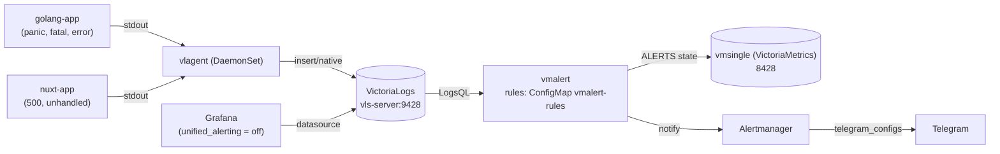

# Алерты по ошибкам и panic из логов приложений: VictoriaLogs + vmalert + Alertmanager → Telegram в Yandex Managed K8s

## Цель статьи

Развернуть в managed Kubernetes связку, которая следит **не за метриками, а за логами**: как только Go-приложение падает с `panic` или `log.Fatal`, а Nuxt-приложение отвечает 500-й или роняет необработанное исключение — в Telegram уходит алерт со ссылкой на приложение и количеством ошибок.

Ключевые решения, которые мы разберём:

- **VictoriaLogs** как хранилище логов (single-node, Helm-чарт `victoria-logs-single`);
- **vlagent** (DaemonSet, чарт `victoria-logs-collector`) — собирает логи всех подов и отдаёт их в VictoriaLogs;
- **vmalert** исполняет правила, написанные на **LogsQL** (а не PromQL), и смотрит на VictoriaLogs как на datasource;
- правила живут **в файле**, а не в Grafana UI: единственный source of truth — ConfigMap `vmalert-rules`;
- **Alertmanager шлёт алерты напрямую в Telegram** через нативный `telegram_configs`, без промежуточного bridge;
- управление алертами через Grafana UI (`unified_alerting`) **отключено**.

Почему это актуально: лог с текстом `panic: runtime error: invalid memory address or nil pointer dereference` появляется до того, как метрики успеют просесть, и часто является единственным следом проблемы — pod перезапустился, метрика `restart_count` выросла, но сам текст ошибки остался только в логах. Алертинг по логам замыкает этот пробел.

## Архитектура



Поток данных:

1. Приложения пишут логи в `stdout`/`stderr` (12-factor).
2. `vlagent` с каждой ноды собирает логи контейнеров и реплицирует их в VictoriaLogs (`/insert/native`).
3. `vmalert` раз в `1m` исполняет LogsQL-запросы из файла правил против VictoriaLogs (`/select/logsql/stats_query`).
4. Сработавшее правило уходит в Alertmanager.
5. Alertmanager через `telegram_configs` отправляет сообщение напрямую в Telegram-бота.

Важный нюанс: **VictoriaLogs не хранит метрики**, поэтому `vmalert` обязан куда-то писать состояние алертов (`ALERTS`, `ALERTS_FOR_STATE`) и восстанавливать его при рестарте. Для этого в том же `victoria-metrics-k8s-stack` поднят `vmsingle` (single-node VictoriaMetrics), куда `vmalert` пишет через `remoteWrite`/`remoteRead`.

## Стенд: Yandex Managed K8s

Инфраструктура разворачивается Terraform в Yandex Cloud (по аналогии с соседними проектами). Кластер Managed Kubernetes (`k8s.tf`, версия 1.33) состоит из master (управляемый, вне кластера) и группы из 3 узлов `standard-v3`, 4 vCPU / 8 ГБ, preemptible, по одной ноде в зонах `ru-central1-b/-d/-e`. Ноды без публичных IP: `network_interface.nat = false`, исходящий трафик идёт через NAT-шлюз и Route Table (`net.tf`). Публичный адрес есть только у балансировщика Traefik, из которого через `sslip.io` формируются FQDN Grafana и Alertmanager.

Ключевые файлы: [`k8s.tf`](https://github.com/patsevanton/victorialogs-alerting-by-error-panic/blob/main/k8s.tf), [`net.tf`](https://github.com/patsevanton/victorialogs-alerting-by-error-panic/blob/main/net.tf), [`ip-dns.tf`](https://github.com/patsevanton/victorialogs-alerting-by-error-panic/blob/main/ip-dns.tf), [`versions.tf`](https://github.com/patsevanton/victorialogs-alerting-by-error-panic/blob/main/versions.tf).

Все values (`vmks`, `vls`, `vlc`) генерируются Terraform'ом из шаблонов `values/*.yaml.tftpl` через `templatefile` (`monitoring.tf`) в файлы `vmks-values.yaml`, `vls-values.yaml`, `vlc-values.yaml` (в git они не попадают — `.gitignore`). Параметры пробрасываются через `local.*` / `var.*`, FQDN Grafana/Alertmanager формируются из публичного IP Traefik (`terraform output ingress_public_ip`).

### Версии компонентов

| Компонент            | Чарт / образ                     | Версия |
| -------------------- | -------------------------------- | ------ |
| Kubernetes           | Yandex Managed K8s               | 1.33   |
| ingress-контроллер   | traefik                          | 41.3.0 |
| vmks                  | victoria-metrics-k8s-stack       | 0.91.2 |
| VictoriaLogs         | victoria-logs-single             | 0.13.9 |
| vlagent              | victoria-logs-collector          | 0.3.7  |

## Шаг 1. VictoriaLogs

Ставим single-node VictoriaLogs отдельным чартом в namespace `vmks` (там же будет весь стек). Values генерируются Terraform'ом из [`values/vls-values.yaml.tftpl`](https://github.com/patsevanton/victorialogs-alerting-by-error-panic/blob/main/values/vls-values.yaml.tftpl) в файл `vls-values.yaml`:

```bash
helm repo add vm https://victoriametrics.github.io/helm-charts/
helm repo update

helm upgrade --install vls vm/victoria-logs-single \
  --namespace vmks --create-namespace \
  --version 0.13.9 \
  --values vls-values.yaml
```

```yaml
# values/vls-values.yaml.tftpl (рендерится в vls-values.yaml)
nameOverride: ${vls_name_override}

server:
  retentionPeriod: ${vls_retention}
  persistentVolume:
    enabled: true
    storageClassName: ${vls_storage_class}
    size: ${vls_pv_size}
  resources:
    requests:
      cpu: ${vls_cpu_request}
      memory: ${vls_memory_request}
  limits:
    cpu: "${vls_cpu_limit}"
    memory: ${vls_memory_limit}
```

Сервис получит имя `vls-server.vmks.svc.cluster.local` (порт 9428) — именно на него будут смотреть и `vlagent`, и `vmalert`, и datasource Grafana.

## Шаг 2. vlagent

Собираем логи всех подов через DaemonSet `vlagent`. Values генерируются Terraform'ом из [`values/vlc-values.yaml.tftpl`](https://github.com/patsevanton/victorialogs-alerting-by-error-panic/blob/main/values/vlc-values.yaml.tftpl) в файл `vlc-values.yaml`:

```bash
helm upgrade --install vlc vm/victoria-logs-collector \
  --namespace vmks \
  --version 0.3.7 \
  --values vlc-values.yaml
```

```yaml
# values/vlc-values.yaml.tftpl (рендерится в vlc-values.yaml)
nameOverride: ${vlc_name_override}

remoteWrite:
  - url: ${vls_server_url}

collector:
  # Лейблы пода попадают в kubernetes.pod_labels.* — по ним фильтруют алерты.
  includePodLabels: true
  # Не собираем логи самого коллектора (иначе будет шум).
  excludeFilter: "kubernetes.pod_name:=%{HOSTNAME}"

resources:
  requests:
    cpu: ${vlc_cpu_request}
    memory: ${vlc_memory_request}
  limits:
    cpu: ${vlc_cpu_limit}
    memory: ${vlc_memory_limit}
```

`includePodLabels: true` — критично для алертов: каждый лог получает поля `kubernetes.pod_labels.app`, по которым правила отличают `golang-app` от `nuxt-app`. `_stream`-полями по умолчанию становятся `kubernetes.container_name`, `kubernetes.pod_name`, `kubernetes.pod_namespace` — это даёт быструю фильтрацию и группировку в LogsQL.

## Шаг 3. Приложения, которые падают

### Go: `apps/golang-app`

Приложение ([`main.go`](https://github.com/patsevanton/victorialogs-alerting-by-error-panic/blob/main/apps/golang-app/main.go)) пишет логи в `stdout` и содержит эндпоинты под каждый класс ошибок:

| Эндпоинт  | Что происходит в проде                        | Что ловится |
| --------- | --------------------------------------------- | ----------- |
| `/panic`  | `panic("boom: ...")` с `recover` в `defer`    | `panic:` + `ERROR` |
| `/nil`    | nil pointer dereference (runtime-паника, без recover) | `panic:` |
| `/index`  | index out of range (runtime-паника)           | `panic:` |
| `/fatal`  | `log.Fatalf("FATAL: ...")` → `os.Exit(1)`     | `FATAL` |
| `/error`  | лог `ERROR: failed to connect ...`, ответ 502 | `ERROR` |

Главное наблюдение: **`panic:` есть и у явного `panic("...")`, и у runtime-паник** (`nil pointer dereference`, `index out of range`). Поэтому одно правило `_msg:~"panic:"` ловит все типы паник разом. `log.Fatal` — отдельный случай: он пишет сообщение и завершает процесс, а pod перезапускается; лог остаётся в VictoriaLogs, и его ловит правило по `FATAL`.

```go
// main.go — фрагмент
mux.HandleFunc("/panic", func(w http.ResponseWriter, r *http.Request) {
    defer func() {
        if rec := recover(); rec != nil {
            log.Printf("ERROR: recovered panic on /panic: %v", rec)
            http.Error(w, "internal failure", http.StatusInternalServerError)
        }
    }()
    panic("boom: something went really wrong")
})

mux.HandleFunc("/nil", func(w http.ResponseWriter, r *http.Request) {
    var p *int
    _ = *p // runtime panic: nil pointer dereference
})

mux.HandleFunc("/fatal", func(w http.ResponseWriter, r *http.Request) {
    log.Fatalf("FATAL: unrecoverable configuration error on /fatal")
})
```

Манифест: [`manifests/golang-app.yaml`](https://github.com/patsevanton/victorialogs-alerting-by-error-panic/blob/main/manifests/golang-app.yaml) (Deployment + Service в namespace `apps`).

### Nuxt: `apps/nuxt-app`

Приложение Nitro/Nuxt логирует ошибки серверных хендлеров в `stdout`. Два эндпоинта:

```ts
// server/api/error.ts — 500 через createError
export default defineEventHandler(() => {
  console.error('NUXT_ERROR: upstream database unavailable on /api/error')
  throw createError({ statusCode: 500, statusMessage: 'Upstream database unavailable' })
})

// server/api/throw.ts — необработанное исключение
export default defineEventHandler(() => {
  console.error('NUXT_UNHANDLED: unhandled rejection on /api/throw')
  throw new Error('unhandled exception in /api/throw')
})
```

Здесь в лог пишутся явные маркеры `NUXT_ERROR` и `NUXT_UNHANDLED`, по которым строятся правила. В реальном приложении это будут штатные логи Nitro/Nitro-хендлеров — достаточно договориться о едином формате (`level`, `message`, `requestId`), а правила писать под него.

Манифест: [`manifests/nuxt-app.yaml`](https://github.com/patsevanton/victorialogs-alerting-by-error-panic/blob/main/manifests/nuxt-app.yaml).

```bash
kubectl create namespace apps
kubectl apply -f manifests/golang-app.yaml
kubectl apply -f manifests/nuxt-app.yaml
```

## Шаг 4. Правила алертов в файле

Правила — это ConfigMap `vmalert-rules` ([`manifests/vmalert-rules.yaml`](https://github.com/patsevanton/victorialogs-alerting-by-error-panic/blob/main/manifests/vmalert-rules.yaml)), который использует встроенный vmalert из vmks.

```yaml
apiVersion: v1
kind: ConfigMap
metadata:
  name: vmalert-rules
  namespace: vmks
data:
  alert-rules.yaml: |
    groups:
      - name: golang-app
        type: vlogs
        interval: 1m
        rules:
          - alert: GolangPanicDetected
            expr: |
              kubernetes.pod_labels.app:=golang-app
                | _msg:~"panic:"
                | stats by (kubernetes.pod_name) count() as panics
                | filter panics:>0
            for: 1m
            labels:
              severity: critical
              app: golang-app
            annotations:
              summary: "panic в golang-app"
              description: |
                Паник у пода {{ index $labels "kubernetes.pod_name" }} за 1m: {{ $value }}.

          - alert: GolangFatalLog
            expr: |
              kubernetes.pod_labels.app:=golang-app
                | _msg:~"FATAL"
                | stats count() as fatals
                | filter fatals:>0
            for: 1m
            labels:
              severity: critical
              app: golang-app
            # ...

      - name: nuxt-app
        type: vlogs
        interval: 1m
        rules:
          - alert: NuxtServerError
            expr: |
              kubernetes.pod_labels.app:=nuxt-app
                | _msg:~"NUXT_ERROR"
                | stats count() as errors
                | filter errors:>0
            for: 2m
            # ...

          - alert: NuxtUnhandledRejection
            expr: |
              kubernetes.pod_labels.app:=nuxt-app
                | _msg:~"NUXT_UNHANDLED"
                | stats count() as unhandled
                | filter unhandled:>0
            for: 1m
            # ...
```

Разбор LogsQL-выражения:

- `kubernetes.pod_labels.app:=golang-app` — фильтр по лейблу пода (добавил `vlagent`);
- `_msg:~"panic:"` — регулярка по тексту сообщения;
- `stats by (kubernetes.pod_name) count() as panics` — агрегация числа совпадений по поду;
- `filter panics:>0` — оставляем только группы, где сработало.

Почему `type: vlogs` и `interval` на уровне группы: по умолчанию `vmalert` считает правила `prometheus`-типа и валидирует выражения как PromQL. `type: vlogs` говорит ему, что выражения написаны на LogsQL. Time-фильтр подставляется автоматически (`_time: <interval>`), поэтому в выражениях его писать не нужно.

`stats`-pipe обязателен: `vmalert` забирает из VictoriaLogs не сами строки, а результаты `/select/logsql/stats_query` (счётчики, гистограммы и т.д.) в формате Prometheus API — именно их он сравнивает с порогом.

## Шаг 5. Встроенный vmalert из vmks

`vmalert` приходит вместе с `victoria-metrics-k8s-stack`, и мы только перенаправляем его datasource на VictoriaLogs и подключаем файл правил.

```bash
# Секрет с токеном Telegram-бота (нужен Alertmanager'у).
# Манифест рендерится Terraform'ом из manifests/telegram-bot-token-secret.yaml.tftpl
# (после terraform apply применяем: kubectl apply -f telegram-bot-token-secret.yaml)
kubectl apply -f telegram-bot-token-secret.yaml

# ConfigMap с правилами
kubectl apply -f manifests/vmalert-rules.yaml

helm upgrade --install vmks oci://ghcr.io/victoriametrics/helm-charts/victoria-metrics-k8s-stack \
  --namespace vmks --create-namespace \
  --version 0.91.2 \
  --wait --values vmks-values.yaml
```

Ключевые части [`values/vmks-values.yaml.tftpl`](https://github.com/patsevanton/victorialogs-alerting-by-error-panic/blob/main/values/vmks-values.yaml.tftpl):

```yaml
# datasource VictoriaLogs (${vls_server_url} подставляется Terraform'ом)
vmalert:
  enabled: true
  spec:
    selectAllByDefault: false
    evaluationInterval: 1m
    datasource:
      url: "${vls_server_url}"
    configMaps:
      - vmalert-rules
    extraArgs:
      rule: "/etc/vm/configs/vmalert-rules/*.yaml"
      rule.defaultRuleType: "vlogs"
```

Что здесь важно:

- `datasource.url` — read-эндпоинт VictoriaLogs. `vmalert` шлёт туда LogsQL-запросы.
- `configMaps: [vmalert-rules]` монтирует ConfigMap в `/etc/vm/configs/vmalert-rules`.
- `rule.defaultRuleType: "vlogs"` — глобальный тип правил. Можно задавать и на уровне группы (`type: vlogs`), но дублирование не мешает.
- `selectAllByDefault: false` — отключаем автоподхват всех `VMRule` из кластера: правила идут только из файла, а не из CRD.

Куда `vmalert` пишет состояние:

```yaml
vmsingle:
  enabled: true
  spec:
    retentionPeriod: "${vmks_retention}"
    storage:
      resources:
        requests:
          storage: ${vmks_pv_size}
```

`remoteWrite`/`remoteRead` чарт настраивает автоматически на `vmsingle` (`vmalert` пишет `ALERTS`/`ALERTS_FOR_STATE` и восстанавливает состояние при рестарте).

### Отключаем управление алертами через Grafana UI

Grafana в том же чарте поднимается, но с выключенным alerting-движком:

```yaml
grafana:
  grafana.ini:
    alerting:
      enabled: false
    unified_alerting:
      enabled: false
  plugins:
    - victoriametrics-logs-datasource
```

Здесь два независимых флага: `[alerting] enabled` (legacy-движок) и `[unified_alerting] enabled` (новый движок Grafana Alerting). Оба выключены — алерты управляются только файлом правил и `vmalert`, никакого расхождения с Grafana UI. Datasource VictoriaLogs добавляем через плагин `victoriametrics-logs-datasource` и `defaultDatasources.extra` с явным URL.

## Шаг 6. Alertmanager → Telegram напрямую

Prometheus Alertmanager умеет нативный `telegram_configs`, поэтому bridge не нужен. Токен кладём в Secret — манифест рендерится Terraform'ом из шаблона [`manifests/telegram-bot-token-secret.yaml.tftpl`](https://github.com/patsevanton/victorialogs-alerting-by-error-panic/blob/main/manifests/telegram-bot-token-secret.yaml.tftpl), а в конфиг передаём путь к нему через `bot_token_file` — токен не светится в конфиге.

```yaml
# manifests/telegram-bot-token-secret.yaml.tftpl (рендерится в telegram-bot-token-secret.yaml)
apiVersion: v1
kind: Secret
metadata:
  name: telegram-bot-token
  namespace: vmks
type: Opaque
data:
  bot-token: ${bot_token_b64}
```

В vmks-values подключаем Secret к Alertmanager и описываем ресивер:

```yaml
alertmanager:
  enabled: true
  spec:
    # Secret монтируется оператором в /etc/vm/secrets/telegram-bot-token/bot-token
    secrets:
      - telegram-bot-token
  config:
    route:
      receiver: telegram
      group_by: ["alertname", "app"]
      group_wait: 30s
      group_interval: 5m
      repeat_interval: 4h
    receivers:
      - name: telegram
        telegram_configs:
          - bot_token_file: /etc/vm/secrets/telegram-bot-token/bot-token
            chat_id: ${telegram_chat_id}
            parse_mode: HTML
            send_resolved: true
            message: |-
              {{- range .Alerts }}
              <b>{{ .Status | toUpper }}</b> <code>{{ .Labels.alertname }}</code>
              app: <code>{{ .Labels.app }}</code>
              {{- if .Annotations.summary }}
              {{ .Annotations.summary }}
              {{- end }}
              {{- if .Annotations.description }}
              {{ .Annotations.description }}
              {{- end }}
              {{ end }}
```

Поля `telegram_configs` (из [Prometheus docs](https://prometheus.io/docs/alerting/latest/configuration/#telegram_config)):

- `bot_token_file` — путь к файлу с токеном (предпочтительнее, чем `bot_token` в открытом виде);
- `chat_id` — ID чата/группы (отрицательное число для групп); подставляется Terraform'ом через `${telegram_chat_id}`;
- `parse_mode: HTML` — разметка сообщения;
- `send_resolved: true` — отправлять уведомление и при разрешении алерта.

`chat_id` задаётся в `variables.tf` и попадает в values через `templatefile` в `monitoring.tf`. Токен в `values` не попадает — только в Secret.

## Проверка

```bash
# Компоненты
kubectl get pods -n vmks | grep -E "vls|vlc|vmalert|alertmanager|vmsingle"
```

Образы приложений собираются из `apps/` и пушатся в свой registry (в манифестах прописан `ghcr.io/patsevanton/...` — замените на свой):

```bash
docker build -t ghcr.io/<you>/victorialogs-alerting-by-error-panic-golang:1.0.0 apps/golang-app
docker build -t ghcr.io/<you>/victorialogs-alerting-by-error-panic-nuxt:1.0.0 apps/nuxt-app
```

Провоцируем падения (Go-образ — distroless, без шелла, поэтому идём через port-forward):

```bash
kubectl -n apps port-forward svc/golang-app 8080:8080 &
curl -s -o /dev/null http://localhost:8080/panic   # recover + ERROR в логе
curl -s -o /dev/null http://localhost:8080/nil     # nil pointer -> pod падает
curl -s -o /dev/null http://localhost:8080/fatal   # log.Fatal -> pod падает
kill %1

kubectl -n apps port-forward svc/nuxt-app 3000:3000 &
curl -s -o /dev/null http://localhost:3000/api/error   # 500
curl -s -o /dev/null http://localhost:3000/api/throw   # необработанное исключение
kill %1
```

Логи ушли в VictoriaLogs — смотрим через встроенный UI или HTTP API:

```bash
kubectl -n vmks port-forward svc/vls-server 9428:9428
# UI: http://localhost:9428/select/vmui
# или HTTP API (count по "panic:")
curl -s 'http://localhost:9428/select/logsql/stats_query' \
  --data-urlencode 'query=kubernetes.pod_labels.app:=golang-app | _msg:~"panic:" | stats count()'
```

Проверка состояния алертов в `vmalert`:

```bash
kubectl -n vmks port-forward svc/vmks-victoria-metrics-k8s-stack 8080:8080
# открыть http://localhost:8080/alerts — увидим GolangPanicDetected в состоянии FIRING
```

> Имя сервиса встроенного vmalert — `vmks-victoria-metrics-k8s-stack` (без префикса `vmalert-`, так строит чарт vmks 0.91.2; уточните через `kubectl get svc -n vmks`).

Через `1m` + `for: 1m` в Telegram приходит сообщение вида:

```
FIRING GolangPanicDetected
app: golang-app
panic в golang-app
Паник у пода golang-app-7d9c6b4f5-x2k9p за 1m: 3.
```

## Важные оговорки

- **VictoriaLogs не хранит метрики.** `vmalert` пишет состояние алертов в `vmsingle` (VictoriaMetrics) через `remoteWrite`/`remoteRead`. Без этого состояние не переживёт рестарт `vmalert`.
- **LogsQL-выражение обязано содержать `stats`-pipe.** `vmalert` работает со статистикой (`count()`, `sum()`, `quantile()`, `histogram()`), а не с сырыми строками.
- **`type: vlogs` обязателен** (на группе или через `-rule.defaultRuleType=vlogs`), иначе правила будут валидироваться как PromQL.
- **Time-фильтр не указывайте** — `vmalert` сам добавляет `_time: <interval>`.
- **`includePodLabels: true`** у `vlagent` — иначе `kubernetes.pod_labels.app` в правилах не появится.
- **Отключение Grafana Alerting** — два флага: `[alerting] enabled: false` и `[unified_alerting] enabled: false`.
- **Токен Telegram** храните в Secret и подключайте через `bot_token_file`, а не `bot_token`.

## Заключение

Мы получили алертинг, который срабатывает на сам факт появления ошибки в логах — `panic`, `log.Fatal`, 500-я или необработанное исключение — и шлёт его в Telegram без промежуточных сервисов. Правила живут в одном файле-ConfigMap, datasource — VictoriaLogs, управление алертами через Grafana UI отключено, а `vmalert` взят встроенный из vmks.

Это та же связка, которую команды используют для метрик, но применённая к логам: `vmalert` исполняет LogsQL вместо PromQL, а Alertmanager остаётся общим — так метрики и логи сводятся в один поток уведомлений.

Полезные ссылки:

- [Alerting with Logs](https://docs.victoriametrics.com/victorialogs/vmalert/) — vmalert + VictoriaLogs
- [VictoriaLogs Single Helm chart](https://docs.victoriametrics.com/helm/victoria-logs-single/)
- [VictoriaLogs Collector (vlagent)](https://docs.victoriametrics.com/helm/victoria-logs-collector/)
- [vlagent](https://docs.victoriametrics.com/victorialogs/vlagent/)
- [LogsQL](https://docs.victoriametrics.com/victorialogs/logsql/)
- [Alertmanager: telegram_config](https://prometheus.io/docs/alerting/latest/configuration/#telegram_config)
