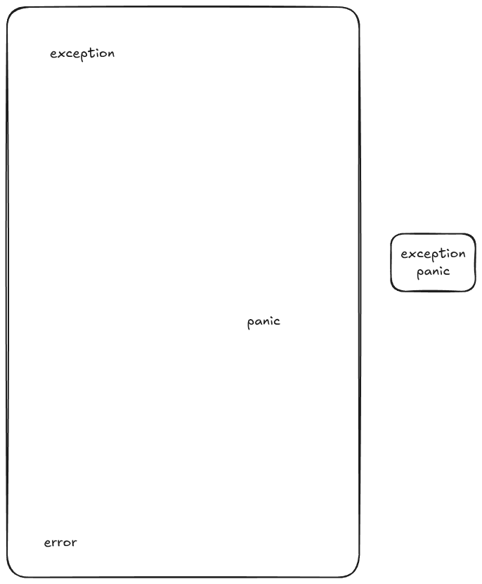
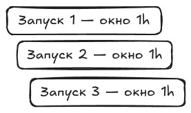
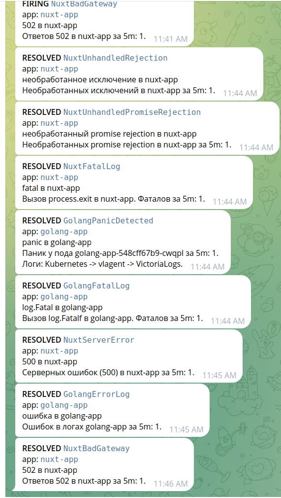

# Алерты по ошибкам и panic из логов приложений: VictoriaLogs + vmalert + Alertmanager → Telegram

## Введение

Классическая ситуация: Go-сервис падает с `panic: runtime error: invalid memory address or nil pointer dereference`, Nuxt-фронтенд логирует `NUXT_UNHANDLED: unhandled rejection`. Клиент видит лишь общее «что-то сломалось» — точный текст ошибки остаётся только в логах.

Решение — алертинг по логам. Связка **VictoriaLogs + Vector + vmalert + Alertmanager** следит за потоком, и как только приложение пишет `panic`, `log.Fatal` или `NUXT_UNHANDLED`, в Telegram уходит алерт. Ниже — как поднять эту связку в Kubernetes без лишней нагрузки на хранилище.

## Архитектура

Ключевые решения:

- **Логи — не временные ряды,** поэтому у них отдельное хранилище (VictoriaLogs), а не `vmsingle` (Шаг 2);
- **LogsQL- и PromQL-правила исполняет разный `vmalert`:** встроенный из vmks остаётся на PromQL, логи ведёт `vmalert-logs` с VictoriaLogs как datasource (Шаги 1 и 3);
- **Правила живут в коде, а не в Grafana UI** — почему, разберём в Шаге 1;
- **Alertmanager шлёт алерты в Telegram** нативным `telegram_configs` (Шаг 6).


Поток данных:

1. Поднимаем `victoria-metrics-k8s-stack` (vmks): `vmagent`, `vmsingle`, `Alertmanager`, Grafana и CRD оператора (состав — в таблице ниже).
2. Приложения пишут логи в `stdout`/`stderr`.
3. Vector (DaemonSet) с каждой ноды собирает логи контейнеров и отправляет их в VictoriaLogs через Elasticsearch bulk API (`/insert/elasticsearch/`).
4. `vmalert-logs` раз в `1m` исполняет LogsQL-запросы из `VMRule` против VictoriaLogs (`/select/logsql/stats_query`).
5. Сработавшее правило уходит в Alertmanager.
6. Alertmanager через `telegram_configs` отправляет сообщение в Telegram-бота.

## Предварительные требования

Нужны:

- **Kubernetes-кластер**;
- **Ingress-контроллер**, чтобы зайти в Grafana;
- **`kubectl` и `helm`**.

Компоненты (все — в namespace `vmks`, кроме Vector в `vector` и приложений в `apps`):

| Компонент | Чарт / манифест | Роль |
| --- | --- | --- |
| victoria-metrics-k8s-stack (vmks) | `victoria-metrics-k8s-stack` | vmagent, vmsingle, встроенный vmalert, Alertmanager, Grafana |
| VictoriaLogs | `victoria-logs-single` | хранилище логов (single-node) |
| Vector | `vector` | сбор логов подов (DaemonSet, роль Agent, namespace `vector`) |
| vmalert-logs | `manifests/vmalert-logs.yaml` | исполняет LogsQL-правила из `VMRule` |
| VMRule | `manifests/vmalert-rules-golang.yaml`, `manifests/vmalert-rules-nuxt.yaml` | правила алертов на LogsQL (по файлу на приложение) |
| golang-app / nuxt-app | `manifests/golang-app.yaml`, `manifests/nuxt-app.yaml` | приложения, роняющие panic/error (namespace `apps`) |

## Шаг 1. victoria-metrics-k8s-stack (vmks)

Ставим `victoria-metrics-k8s-stack` первым: он даёт CRD оператора и `vmagent`, который потом скрейпит метрики VictoriaLogs (Шаг 2).

```bash
helm upgrade --install vmks oci://ghcr.io/victoriametrics/helm-charts/victoria-metrics-k8s-stack \
  --namespace vmks --create-namespace \
  --version 0.91.2 \
  --wait --values values/vmks-values.yaml
```

Файл `values/vmks-values.yaml` (фрагмент):

```yaml
# vmalert (встроенный) исполняет PromQL-правила против vmsingle
# (datasource чарт подставляет сам из vmsingle). Он берёт все VMRule в
# namespace vmalert'а, кроме LogsQL-правил (label type: logs-to-metrics) —
# их исполняет отдельный VMAlert (manifests/vmalert-logs.yaml). Так кастомный
# PromQL-VMRule, созданный вручную без специальных лейблов, подхватывается сам.
vmalert:
  enabled: true
  spec:
    selectAllByDefault: false
    ruleSelector:
      matchExpressions:
        - key: type
          operator: NotIn
          values:
            - logs-to-metrics
    # Как часто встроенный vmalert исполняет группы PromQL-правил: раз в минуту.
    evaluationInterval: 1m

alertmanager:
  enabled: true
  spec:
    # Secret telegram-bot-token монтируется оператором в
    # /etc/vm/secrets/telegram-bot-token/bot-token.
    secrets:
      - telegram-bot-token
  ingress:
    enabled: true
    ingressClassName: traefik
    hosts:
      - ${alertmanager_fqdn}
  config:
    global:
      resolve_timeout: 5m
      http_config:
        proxy_from_environment: true
    route:
      receiver: telegram
      group_by: ["alertname", "app"]
      group_wait: 30s
      group_interval: 5m
      repeat_interval: 4h
      # Watchdog, InfoInhibitor и RecordingRulesNoData — служебные алерты vmks:
      # выполняют свою работу, но в Telegram не шлются. RecordingRulesNoData
      # шумит, когда recording-правило count:up0 отдаёт 0 семплов — это здоровое
      # состояние (нет упавших таргетов), а не проблема.
      routes:
        - matchers:
            - alertname="Watchdog"
          receiver: "null"
        - matchers:
            - alertname="InfoInhibitor"
          receiver: "null"
    receivers:
      - name: "null"
      - name: telegram
        telegram_configs:
          - bot_token_file: /etc/vm/secrets/telegram-bot-token/bot-token
            chat_id: ${telegram_chat_id}
            parse_mode: HTML
            send_resolved: true
            message: |-
              {{- range .Alerts }}
              <b>{{ .Status | toUpper }}</b> <code>{{ .Labels.alertname }}</code>
              app: <code>{{ .Labels.app }}</code>
              {{- if .Annotations.summary }}
              {{ .Annotations.summary }}
              {{- end }}
              {{- if .Annotations.description }}
              {{ .Annotations.description }}
              {{- end }}
              {{ end }}
```

`ruleSelector` с `NotIn` оставляет дефолтные PromQL-правила стека и кастомные PromQL-`VMRule` без специальных лейблов. `vmsingle` и `alertmanager` включены по дефолту чарта: `vmalert-logs` пишет состояние алертов в `vmsingle`, уведомления уходят через `alertmanager` (Шаги 3 и 6). Блок `alertmanager` подробнее разобран в Шаге 6.

### Почему алерты по логам не делаем через Grafana UI

Для метрик алерт из Explore почти бесплатен: PromQL считается по уже агрегированным рядам. Для логов каждое правило — полноценный запрос к VictoriaLogs со `stats`, фильтрами и регулярками, и он исполняется каждую минуту (`evaluationInterval: 1m`).

Когда алерты вешает вся команда из UI, среди них появляются неоптимальные: регулярка по всему тексту без фильтра по поду, слишком широкое окно, правило на каждый чих. VictoriaLogs отвечает на десятки таких запросов каждый интервал; один кривой алерт грузит систему сильнее, чем весь пайплайн приёма логов.

`VMRule` держит правила в git: интервал, запрос, порог, окно `for` видны до применения в кластер. На ревью проверяют, что у каждого правила узкий фильтр по `kubernetes.pod_labels.app`, а регулярка бьёт только по нужному тексту.

#### Отключить создание алертов через UI нельзя

Плагин `victoriametrics-logs-datasource` объявляет `alerting: true`, поэтому Grafana разрешает создавать алерты по логам через UI независимо от настроек datasource. `manageAlerts: false` в `jsonData` влияет только на **datasource-managed** правила — для VictoriaLogs они всё равно не работают (LogsQL исполняет `vmalert-logs`, а не Grafana ruler), а **Grafana-managed** алерты флаг не затрагивает. Хранить алерты всё равно нужно в git.

По этой теме заведены два issue:

- [VictoriaMetrics/victorialogs-datasource#727](https://github.com/VictoriaMetrics/victorialogs-datasource/issues/727)
- [grafana/grafana#132468](https://github.com/grafana/grafana/issues/132468)

## Шаг 2. VictoriaLogs

Ставим single-node VictoriaLogs отдельным чартом в namespace `vmks`. Важен порядок: vmks (Шаг 1) уже поднят — только тогда `vmServiceScrape` из values ниже передаст собственные метрики VictoriaLogs через `vmagent` в `vmsingle`.

```bash
helm repo add vm https://victoriametrics.github.io/helm-charts/
helm repo update

helm upgrade --install vls vm/victoria-logs-single \
  --namespace vmks --create-namespace \
  --version 0.13.9 \
  --values values/vls-values.yaml
```

Файл `values/vls-values.yaml`:

```yaml
# VictoriaLogs single-node.
nameOverride: vls

server:
  # VictoriaLogs отдаёт собственные метрики на /metrics.
  vmServiceScrape:
    enabled: true
```

Сервис получит имя `vls-server.vmks.svc.cluster.local` (порт 9428) — на него смотрят Vector, `vmalert-logs` и datasource Grafana.

## Шаг 3. Vector

Собираем логи всех подов через DaemonSet Vector (helm chart `vector`, роль `Agent`). Вместо `vlagent` используем Vector из-за [VictoriaMetrics/VictoriaLogs#1790](https://github.com/VictoriaMetrics/VictoriaLogs/issues/1790).

```bash
helm repo add vector https://helm.vector.dev
helm repo update

helm upgrade --install vector vector/vector \
  --namespace vector --create-namespace \
  --version 0.58.0 \
  --values values/vector-values.yaml
```

Файл `values/vector-values.yaml`:

```yaml
# Vector (DaemonSet, роль Agent) собирает логи всех подов и шлёт в VictoriaLogs.
role: Agent

customConfig:
  data_dir: /vector-data-dir

  api:
    enabled: true
    address: 0.0.0.0:8686

  sources:
    kubernetes_logs:
      type: kubernetes_logs

  sinks:
    vlogs:
      type: elasticsearch
      inputs: [kubernetes_logs]
      endpoints:
        - http://vls-server.vmks.svc.cluster.local:9428/insert/elasticsearch/
      api_version: v8
      mode: bulk
      compression: gzip
      healthcheck:
        enabled: false
      query:
        _msg_field: message
        _time_field: timestamp
        _stream_fields: kubernetes.pod_namespace,kubernetes.container_name
        ignore_fields: file,source_type,kubernetes.container_id,kubernetes.container_image_id,kubernetes.pod_ip,kubernetes.pod_ips,kubernetes.pod_uid,kubernetes.node_labels.*,kubernetes.pod_annotations.*,kubernetes.namespace_labels.*
```

`query._msg_field: message` и `query._time_field: timestamp` маппят поля Vector на спецполя VictoriaLogs: текст берётся из `message`, время — из `timestamp`. После этого в VictoriaLogs `_msg` и `_time` заполнены так же, как при vlagent, а `stream`, `kubernetes.pod_labels.*` и `kubernetes.pod_name` Vector отдаёт как есть — поэтому правила `VMRule` из Шага 5 не меняются.

`_stream_fields` задаёт поток VictoriaLogs (без него все строки попадают в `_stream: {}`). `ignore_fields` отбрасывает шум Vector: `file`, `source_type`, id контейнера/пода, `node_labels.*`, `pod_annotations.*`.

Логи самого коллектора не собираются: чарт ставит поду лейбл `vector.dev/exclude: "true"`, а source `kubernetes_logs` по умолчанию пропускает поды с этим лейблом.

### Как Vector шлёт в VictoriaLogs: протоколы

Vector не умеет нативный протокол vlagent (`/insert/native`). Он передаёт логи через HTTP API VictoriaLogs. Есть два рабочих варианта:

| Протокол | Sink `type` | Как в VictoriaLogs | Особенности |
| --- | --- | --- | --- |
| **Elasticsearch bulk** (используем) | `elasticsearch` | `/insert/elasticsearch/` | bulk-батчинг, gzip, `api_version: v8` — дешёвая доставка больших объёмов. Рекомендован в [доке VictoriaLogs](https://docs.victoriametrics.com/victorialogs/data-ingestion/vector/) |
| HTTP JSON stream (ndjson) | `http` | `/insert/jsonline` | codec `json` + `framing: newline_delimited`, проще в отладке, но без bulk-аккумуляции — на больших потоках дороже |

Мы берём **Elasticsearch bulk**: он агрегирует строки в пакеты и сжимает их, что для потока логов Kubernetes даёт меньше запросов и накладных расходов по CPU/сети, чем построчная ndjson-отправка.

### vmalert-logs и правила VMRule

Отдельный `VMAlert` `vmalert-logs` под LogsQL объявлен манифестом [`manifests/vmalert-logs.yaml`](https://github.com/patsevanton/victorialogs-alerting-by-error-panic/blob/main/manifests/vmalert-logs.yaml):

Файл `manifests/vmalert-logs.yaml`:

```yaml
apiVersion: operator.victoriametrics.com/v1beta1
kind: VMAlert
metadata:
  name: vmalert-logs
  namespace: vmks
spec:
  datasource:
    url: http://vls-server.vmks.svc.cluster.local:9428
  evaluationInterval: 1m
  selectAllByDefault: false
  ruleSelector:
    matchLabels:
      type: logs-to-metrics
  remoteWrite:
    url: http://vmsingle-vmks-victoria-metrics-k8s-stack.vmks.svc.cluster.local:8428
  remoteRead:
    url: http://vmsingle-vmks-victoria-metrics-k8s-stack.vmks.svc.cluster.local:8428
  notifiers:
    - url: http://vmalertmanager-vmks-victoria-metrics-k8s-stack.vmks.svc.cluster.local:9093
```

`datasource.url` — VictoriaLogs. `ruleSelector: type: logs-to-metrics` — только LogsQL-`VMRule`. `remoteWrite`/`remoteRead` — состояние алертов пишется в `vmsingle` и восстанавливается оттуда при рестарте.

Применяем `vmalert-logs` и правила `VMRule` (сами правила разбираются в Шаге 5):

```bash
kubectl apply -f manifests/vmalert-logs.yaml
kubectl apply -f manifests/vmalert-rules-golang.yaml
kubectl apply -f manifests/vmalert-rules-nuxt.yaml
```

Порядок строгий: vmks создаёт CRD и оператор (Шаг 1), VictoriaLogs — datasource (Шаг 2), и только после этого применяются `vmalert-logs` и `VMRule`. Приложения (Шаг 4) поднимаются уже при готовом алертинге.

## Шаг 4. Приложения, которые падают

### Go: `apps/golang-app`

Приложение ([`main.go`](https://github.com/patsevanton/victorialogs-alerting-by-error-panic/blob/main/apps/golang-app/main.go)) пишет обычные логи в `stdout` (`infoLog`), а ошибки/panic/fatal — в `stderr` (`errLog`):

| Эндпоинт  | Что происходит в проде                        | Что ловится |
| --------- | --------------------------------------------- | ----------- |
| `/panic`  | `panic("boom: ...")` с `recover` в `defer`, лог `ERROR: recovered panic ...` | `GolangRecoveredPanic` |
| `/nil`    | nil pointer dereference (runtime-паника, без recover) | `GolangPanicDetected` |
| `/index`  | index out of range (runtime-паника)           | `GolangPanicDetected` |
| `/fatal`  | `errLog.Fatalf("FATAL: ...")` → `os.Exit(1)`  | `GolangFatalLog` |
| `/error`  | лог `ERROR: failed to connect ...`, ответ 502 | `GolangErrorLog` |

**Runtime-паники** (`nil pointer dereference`, `index out of range`) Go печатает как `http: panic serving ...: runtime error: ...` — двоеточия после `panic` там нет, поэтому правило `GolangPanicDetected` матчит `_msg:~"runtime error"`, а не `panic:`. Явный `panic("...")` с `recover` уходит в `ERROR: recovered panic ...`: на него заведено отдельное правило `GolangRecoveredPanic`, а из `GolangErrorLog` такие строки исключены (`NOT _msg:~"recovered panic"`) — каждое сообщение даёт ровно один алерт. `log.Fatal` пишет сообщение и завершает процесс; pod перезапускается, лог остаётся в VictoriaLogs, его ловит `GolangFatalLog`.

```go
// main.go — фрагмент
mux.HandleFunc("/panic", func(w http.ResponseWriter, r *http.Request) {
    defer func() {
        if rec := recover(); rec != nil {
            errLog.Printf("ERROR: recovered panic on /panic: %v", rec)
            http.Error(w, "internal failure", http.StatusInternalServerError)
        }
    }()
    panic("boom: something went really wrong")
})

mux.HandleFunc("/nil", func(w http.ResponseWriter, r *http.Request) {
    var p *int
    _ = *p // runtime panic: nil pointer dereference
})

mux.HandleFunc("/fatal", func(w http.ResponseWriter, r *http.Request) {
    errLog.Fatalf("FATAL: unrecoverable configuration error on /fatal")
})
```

Манифест: [`manifests/golang-app.yaml`](https://github.com/patsevanton/victorialogs-alerting-by-error-panic/blob/main/manifests/golang-app.yaml) (Deployment + Service в namespace `apps`).

### Nuxt: `apps/nuxt-app`

Nitro/Nuxt логирует ошибки серверных хендлеров через `console.error` (в `stderr`):

| Эндпоинт      | Что происходит в проде                          | Что ловится |
| ------------- | ----------------------------------------------- | ----------- |
| `/api/error`  | `createError` со `statusCode: 500`              | `NUXT_ERROR` |
| `/api/throw`  | необработанное исключение (`throw new Error`)   | `NUXT_UNHANDLED` |
| `/api/rejection` | необработанный promise rejection            | `NUXT_REJECTION` |
| `/api/fatal`  | `console.error('NUXT_FATAL: ...')` + `process.exit(1)` | `NUXT_FATAL` |
| `/api/error-502` | лог `NUXT_502: ...`, ответ 502 (процесс живёт) | `NUXT_502` |

Правила строятся по этим маркерам. В реальном приложении достаточно договориться о едином формате (`level`, `message`, `requestId`) и писать правила под него.

```ts
// server/api/error.ts — 500 через createError
export default defineEventHandler(() => {
  console.error('NUXT_ERROR: upstream database unavailable on /api/error')
  throw createError({ statusCode: 500, statusMessage: 'Upstream database unavailable' })
})

// server/api/throw.ts — необработанное исключение
export default defineEventHandler(() => {
  console.error('NUXT_UNHANDLED: unhandled rejection on /api/throw')
  throw new Error('unhandled exception in /api/throw')
})

// server/api/rejection.ts — необработанный promise rejection
export default defineEventHandler(() => {
  console.error('NUXT_REJECTION: unhandled promise rejection on /api/rejection')
  void Promise.reject(new Error('unhandled rejection in /api/rejection'))
  return { status: 'triggered' }
})

// server/api/fatal.ts — фатальная ошибка, process.exit(1)
export default defineEventHandler(() => {
  console.error('NUXT_FATAL: unrecoverable configuration error on /api/fatal')
  process.exit(1)
})

// server/api/error-502.ts — ошибка без краха, ответ 502
export default defineEventHandler((event) => {
  console.error('NUXT_502: upstream timeout on /api/error-502')
  setResponseStatus(event, 502)
  return { error: 'Bad Gateway' }
})
```

Манифест: [`manifests/nuxt-app.yaml`](https://github.com/patsevanton/victorialogs-alerting-by-error-panic/blob/main/manifests/nuxt-app.yaml).

```bash
kubectl create namespace apps
kubectl apply -f manifests/golang-app.yaml
kubectl apply -f manifests/nuxt-app.yaml
```

### Ошибки пишутся только в stderr, а не в stdout

В обоих приложениях одно правило: **обычные логи — в stdout, panic/fatal/error/500/502 и необработанные исключения — только в stderr.** Это контракт с пайплайном алертинга.

Kubernetes-рантайм пишет stdout и stderr контейнера в два файла (`*.log`), а Vector размечает каждую строку полем `stream=stdout` или `stream=stderr`. VictoriaLogs хранит `stream` как обычное поле. Если ошибки пишутся в stdout, этого сигнала нет: остаётся ловить их только по тексту.

В LogsQL регулярка по сообщению (`_msg:~"panic"`) — самая дорогая операция: она читает тело каждой строки. Фильтр по полю (`stream:=stderr`) и по лейблу (`kubernetes.pod_labels.app:=...`) — отбор по уже проиндексированным значениям, он дёшев. Порядок: сначала app и stream, потом регулярка по оставшимся строкам. Без `stream:=stderr` регулярка шла бы по всему stdout — info/debug на каждый запуск правила.

### Примерная разница в нагрузке на VictoriaLogs

Пусть у приложения за минуту:

- **stdout** (info/debug/access): 10 000 строк;
- **stderr** (ошибки, panic, warnings): 100 строк.

Тогда для одного правила с `_time: 2m`:

| Порядок фильтров в правиле | Сколько строк читает VictoriaLogs под регулярку за исполнение |
| --- | --- |
| только `_msg:~"..."` (по всему потоку) | ~20 200 (весь stdout + stderr за 2m) |
| `app:=...` потом `_msg:~"..."` | ~20 200 (app не разделяет поток сообщения) |
| `app:=...` → `stream:=stderr` → `_msg:~"..."` | 200 (2 минуты только stderr) |

`stream:=stderr` убирает ~99% строк до регулярки. Правило исполняется каждый `interval` (у нас раз в 1m) и сканирует окно `_time` заново: без `stream` за час под регулярку ушло бы ~1,2 млн строк, с ним — ~12 тысяч.

Отбор по полям и по `_stream` VictoriaLogs делает по индексам/блокам стримов почти бесплатно; регулярка — CPU на распаковку и сравнение текста. Поэтому в Шаге 5 `stream:=stderr` стоит перед `_msg:~"..."` , а `stats` — в конце, когда агрегировать уже почти нечего.

Чтобы понять наглядко сколько нужно прочитать логов в stdout и сколько нужно прочитать логов в stderr сделаем примерную картину. Слева пустое простанство это обычные логи. Справа поток только stderr.



## Шаг 5. Правила алертов в VMRule

Правила — два CRD `VMRule` по приложениям ([`manifests/vmalert-rules-golang.yaml`](https://github.com/patsevanton/victorialogs-alerting-by-error-panic/blob/main/manifests/vmalert-rules-golang.yaml) и [`manifests/vmalert-rules-nuxt.yaml`](https://github.com/patsevanton/victorialogs-alerting-by-error-panic/blob/main/manifests/vmalert-rules-nuxt.yaml)). Их исполняет `vmalert-logs` (Шаг 3). Разбиение по файлу упрощает ревью и CODEOWNERS. Оба `VMRule` уже применены в конце Шага 3; ниже — разбор содержимого.

Файл `manifests/vmalert-rules-golang.yaml`:

```yaml
apiVersion: operator.victoriametrics.com/v1beta1
kind: VMRule
metadata:
  name: vmalert-rules-golang
  namespace: vmks
  labels:
    type: logs-to-metrics
spec:
  groups:
    - name: golang-app
      type: vlogs
      # Как часто выполняется LogsQL-запрос этой группы: раз в минуту.
      # Переопределяет evaluationInterval из VMAlert.
      interval: 1m
      rules:
        - alert: GolangPanicDetected
          # Runtime-паники (`nil pointer dereference`, `index out of range`)
          # Go пишет как `http: panic serving ...: runtime error: ...` — без
          # двоеточия после panic, поэтому ловим по `runtime error`.
          expr: |
            _time: 2m
              | kubernetes.pod_labels.app:=golang-app
              | stream:=stderr
              | _msg:~"runtime error"
              | stats by (kubernetes.pod_name) count() as panics
              | filter panics:>0
          for: 1m
          labels:
            severity: critical
            app: golang-app
          annotations:
            summary: "runtime panic в golang-app"
            description: |
              Runtime-паник у пода {{ index $labels "kubernetes.pod_name" }} за 2m: {{ $value }}.

        - alert: GolangRecoveredPanic
          # panic("..."), перехваченный recover: приложение живёт, но в stderr
          # уходит `ERROR: recovered panic ...`. Отдельный алерт, чтобы
          # GolangErrorLog не дублировал его.
          expr: |
            _time: 2m
              | kubernetes.pod_labels.app:=golang-app
              | stream:=stderr
              | _msg:~"recovered panic"
              | stats by (kubernetes.pod_name) count() as recovered
              | filter recovered:>0
          for: 1m
          labels:
            severity: critical
            app: golang-app
          annotations:
            summary: "recovered panic в golang-app"
            description: |
              Перехваченных panic (recover) у пода {{ index $labels "kubernetes.pod_name" }} за 2m: {{ $value }}.

        - alert: GolangFatalLog
          expr: |
            _time: 2m
              | kubernetes.pod_labels.app:=golang-app
              | stream:=stderr
              | _msg:~"FATAL"
              | stats count() as fatals
              | filter fatals:>0
          for: 1m
          labels:
            severity: critical
            app: golang-app
          annotations:
            summary: "log.Fatal в golang-app"
            description: |
              Вызов log.Fatalf в golang-app. Фаталов за 2m: {{ $value }}.

        - alert: GolangErrorLog
          # NOT _msg:~"recovered panic" исключает /panic: его ведёт
          # GolangRecoveredPanic, иначе одно событие давало бы два алерта.
          expr: |
            _time: 2m
              | kubernetes.pod_labels.app:=golang-app
              | stream:=stderr
              | _msg:~"ERROR"
              | NOT _msg:~"recovered panic"
              | stats count() as errors
              | filter errors:>0
          for: 2m
          labels:
            severity: warning
            app: golang-app
          annotations:
            summary: "ошибка в golang-app"
            description: "Ошибок в логах golang-app за 2m: {{ $value }}."
```

У nuxt-app та же схема пайпа (`_time` → app → `stream:=stderr` → `_msg` → `stats` → `filter`), другие маркеры и окна `for`:

Файл `manifests/vmalert-rules-nuxt.yaml`:

```yaml
apiVersion: operator.victoriametrics.com/v1beta1
kind: VMRule
metadata:
  name: vmalert-rules-nuxt
  namespace: vmks
  labels:
    type: logs-to-metrics
spec:
  groups:
    - name: nuxt-app
      type: vlogs
      # Как часто выполняется LogsQL-запрос этой группы: раз в минуту.
      # Переопределяет evaluationInterval из VMAlert.
      interval: 1m
      rules:
        - alert: NuxtServerError
          expr: |
            _time: 2m
              | kubernetes.pod_labels.app:=nuxt-app
              | stream:=stderr
              | _msg:~"NUXT_ERROR"
              | stats count() as errors
              | filter errors:>0
          for: 2m
          labels:
            severity: warning
            app: nuxt-app
          annotations:
            summary: "500 в nuxt-app"
            description: "Серверных ошибок (500) в nuxt-app за 2m: {{ $value }}."

        - alert: NuxtUnhandledRejection
          expr: |
            _time: 2m
              | kubernetes.pod_labels.app:=nuxt-app
              | stream:=stderr
              | _msg:~"NUXT_UNHANDLED"
              | stats count() as unhandled
              | filter unhandled:>0
          for: 1m
          labels:
            severity: critical
            app: nuxt-app
          annotations:
            summary: "необработанное исключение в nuxt-app"
            description: |
              Необработанных исключений в nuxt-app за 2m: {{ $value }}.

        - alert: NuxtUnhandledPromiseRejection
          expr: |
            _time: 2m
              | kubernetes.pod_labels.app:=nuxt-app
              | stream:=stderr
              | _msg:~"NUXT_REJECTION"
              | stats count() as rejections
              | filter rejections:>0
          for: 1m
          labels:
            severity: critical
            app: nuxt-app
          annotations:
            summary: "необработанный promise rejection в nuxt-app"
            description: |
              Необработанных promise rejection в nuxt-app за 2m: {{ $value }}.

        - alert: NuxtFatalLog
          expr: |
            _time: 2m
              | kubernetes.pod_labels.app:=nuxt-app
              | stream:=stderr
              | _msg:~"NUXT_FATAL"
              | stats count() as fatals
              | filter fatals:>0
          for: 1m
          labels:
            severity: critical
            app: nuxt-app
          annotations:
            summary: "fatal в nuxt-app"
            description: |
              Вызов process.exit в nuxt-app. Фаталов за 2m: {{ $value }}.

        - alert: NuxtBadGateway
          expr: |
            _time: 2m
              | kubernetes.pod_labels.app:=nuxt-app
              | stream:=stderr
              | _msg:~"NUXT_502"
              | stats count() as badgateways
              | filter badgateways:>0
          for: 2m
          labels:
            severity: warning
            app: nuxt-app
          annotations:
            summary: "502 в nuxt-app"
            description: "Ответов 502 в nuxt-app за 2m: {{ $value }}."
```

Разбор LogsQL-выражения:

- `_time: 2m` — окно выборки: события за последние 2 минуты;
- `kubernetes.pod_labels.app:=golang-app` — фильтр по лейблу пода (добавил Vector);
- `stream:=stderr` — только stderr, куда приложение пишет ошибки;
- `_msg:~"panic"` — регулярка по тексту;
- `stats by (kubernetes.pod_name) count() as panics` — число совпадений по поду;
- `filter panics:>0` — только группы, где сработало.

По умолчанию `vmalert` считает правила `prometheus`-типа и валидирует выражения как PromQL. `type: vlogs` на группе говорит, что выражения написаны на LogsQL. Time-фильтр задан явно (`_time: 2m`) — это окно VictoriaLogs сканирует на каждом исполнении.

#### `interval` против `_time`

У группы `interval: 1m`, в выражении — `_time: 2m`. Они не дублируют друг друга:

- `interval` (или `evaluationInterval: 1m` у `VMAlert`) — как часто `vmalert-logs` исполняет группу;
- `_time` — какое окно данных сканирует каждый запрос.

Окно шире интервала, чтобы сгладить одиночный всплеск: правило срабатывает устойчиво, а не дёргается на каждой строке. Нагрузка на VictoriaLogs растёт с шириной окна, а не с частотой.

Если параметры разъедутся:

- `interval` больше `_time` (раз в 5m, окно 1m) — «слепые» промежутки: событие между запусками пропускается, алерт моргает.
- `interval` сильно меньше `_time` (раз в 10s, окно 5m) — почти каждый запуск пересчитывает одни и те же 5 минут. Интервал меньше 1m для логов брать не стоит.

У нас критичные правила исполняются раз в минуту с окном 2m и `for: 1m`: от появления ошибки в логе до FIRING — не больше пары минут.

#### Почему не стоит брать слишком широкое `_time`

`_time: 1h` — не «посмотреть назад на час», а «каждое исполнение заново сканирует весь час». При `interval: 1m` из этих 60 минут 59 уже отсканированы минутой ранее.

Схема: одна строка — одно исполнение правила, длина строки — объём сканируемых логов.

_time: 1h при interval: 1m — широкое окно перечитывает почти весь час на каждом запуске:



_time: 2m — окно минимально, повторяется только 1 минута из 2:


С `_time: 1h` за 10 минут правило перечитает час логов десять раз, хотя нового материала 10 минут. С `_time: 2m` сканируется 2 минуты вместо 60 — алерт срабатывает и держится `for: 1m` так же. `_time` берут минимально достаточным, чтобы перекрыть `interval` и `for` (у нас — 2m при `interval: 1m`).

`stats`-pipe обязателен: `vmalert-logs` забирает не сами строки, а результаты `/select/logsql/stats_query` (счётчики, гистограммы) в формате Prometheus API — их он сравнивает с порогом.

Почему для Nuxt отдельные алерты, а не один с общей регуляркой:

- разные окна `for`: `2m` для «мягких» (`NuxtServerError`, `NuxtBadGateway`) и `1m` для критичных — в одном алерте только одно окно;
- разные `labels` и маршруты: критические события и 500/502 обычно хотят разного приоритета;
- в алерте сразу виден класс сбоя.

Объединять имеет смысл только если responder, приоритет и `for` совпадают.

## Шаг 6. Alertmanager → Telegram напрямую

Токен кладём в Secret, в конфиг передаём путь через `bot_token_file` — токен не светится в конфиге.

Файл `telegram-bot-token-secret.yaml`:

```yaml
apiVersion: v1
kind: Secret
metadata:
  name: telegram-bot-token
  namespace: vmks
type: Opaque
data:
  bot-token: ${bot_token_b64}
```

В vmks-values (см. Шаг 1) подключаем Secret к Alertmanager. Служебные алерты vmks (`Watchdog`, `InfoInhibitor`, `RecordingRulesNoData`) уходят в `null`-ресивер и в Telegram не шлются:

Файл `values/vmks-values.yaml` (фрагмент):

```yaml
alertmanager:
  enabled: true
  spec:
    # Secret монтируется оператором в /etc/vm/secrets/telegram-bot-token/bot-token
    secrets:
      - telegram-bot-token
  config:
    global:
      resolve_timeout: 5m
    route:
      receiver: telegram
      group_by: ["alertname", "app"]
      group_wait: 30s
      group_interval: 5m
      repeat_interval: 4h
      routes:
        - matchers:
            - alertname="Watchdog"
          receiver: "null"
        - matchers:
            - alertname="InfoInhibitor"
          receiver: "null"
        - matchers:
            - alertname="RecordingRulesNoData"
          receiver: "null"
    receivers:
      - name: "null"
      - name: telegram
        telegram_configs:
          - bot_token_file: /etc/vm/secrets/telegram-bot-token/bot-token
            chat_id: ${telegram_chat_id}
            parse_mode: HTML
            send_resolved: true
            message: |-
              {{- range .Alerts }}
              <b>{{ .Status | toUpper }}</b> <code>{{ .Labels.alertname }}</code>
              app: <code>{{ .Labels.app }}</code>
              {{- if .Annotations.summary }}
              {{ .Annotations.summary }}
              {{- end }}
              {{- if .Annotations.description }}
              {{ .Annotations.description }}
              {{- end }}
              {{ end }}
```

Поля `telegram_configs` (из [Prometheus docs](https://prometheus.io/docs/alerting/latest/configuration/#telegram_config)):

- `bot_token_file` — путь к файлу с токеном (предпочтительнее, чем `bot_token` в открытом виде);
- `chat_id` — ID чата/группы (отрицательное число для групп); подставляется Terraform'ом через `${telegram_chat_id}`;
- `parse_mode: HTML` — разметка сообщения;
- `send_resolved: true` — уведомление и при разрешении алерта.

`secrets` монтирует Secret в под Alertmanager (оператор кладёт файл в `/etc/vm/secrets/telegram-bot-token/bot-token`).

В Telegram приходят алерты:



## Заключение

Алертинг срабатывает на появление в логах `panic`, `log.Fatal`, 500 или необработанного исключения и шлёт его в Telegram. Правила — два `VMRule` (golang и nuxt), datasource — VictoriaLogs, LogsQL исполняет отдельный `vmalert-logs`. Alertmanager общий с метриками: оба потока сходятся в одни уведомления.

Полезные ссылки:

- [Alerting with Logs](https://docs.victoriametrics.com/victorialogs/vmalert/) — vmalert + VictoriaLogs
- [VictoriaLogs Single Helm chart](https://docs.victoriametrics.com/helm/victoria-logs-single/)
- [VictoriaLogs: Vector data ingestion](https://docs.victoriametrics.com/victorialogs/data-ingestion/vector/) — как Vector пишет логи в VictoriaLogs
- [Vector: install via Helm](https://vector.dev/docs/setup/installation/package-managers/helm/)
- [VictoriaMetrics/VictoriaLogs#1790](https://github.com/VictoriaMetrics/VictoriaLogs/issues/1790) — почему вместо vlagent используется Vector
- [LogsQL](https://docs.victoriametrics.com/victorialogs/logsql/)
- [Alertmanager: telegram_config](https://prometheus.io/docs/alerting/latest/configuration/#telegram_config)
