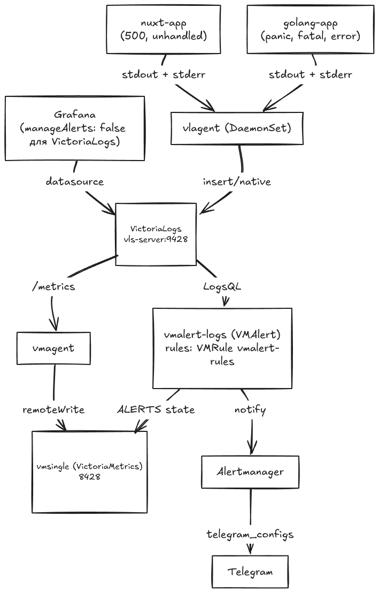

# Алерты по ошибкам и panic из логов приложений: VictoriaLogs + vmalert + Alertmanager → Telegram

## Введение

Классическая ситуация: Go-сервис падает с `panic: runtime error: invalid memory address or nil pointer dereference`, Nuxt-фронтенд логирует `NUXT_UNHANDLED: unhandled rejection`. Сама ошибка при этом больше нигде не живёт — ни в интерфейсе, ни в базе. Клиент видит лишь общее «что-то сломалось», а точный текст ошибки остаётся только в логах. Значит, и узнать о проблеме вовремя можно только из логов.

Решение — алертинг по логам. Связка **VictoriaLogs + vlagent + vmalert + Alertmanager** следит за потоком логов, и как только приложение роняет `panic`, `log.Fatal` или `NUXT_UNHANDLED`, — в Telegram уходит алерт. Эта статья — пошаговый разбор того, как поднять такую связку в Kubernetes и не заплатить за это чрезмерной ценой.

## Архитектура

Ключевые решения, которые мы разберём:

- **VictoriaLogs как хранилище логов.** Логи — не временные ряды, поэтому хранилище отдельное от метрик;
- **Отдельный `vmalert` под LogsQL (`vmalert-logs`).** Встроенный `vmalert` из vmks исполняет только PromQL-правила стека, поэтому логи ведёт второй `vmalert` с VictoriaLogs как datasource;
- **Правила живут в коде, а не в Grafana UI.** Почему — разберём ниже;
- **Alertmanager шлёт алерты напрямую в Telegram** через нативный `telegram_configs`, без промежуточного bridge.



Поток данных:

1. Используем `victoria-metrics-k8s-stack` (vmks): внутри которого `vmagent`, `vmsingle`, встроенный `vmalert`, `Alertmanager` и `Grafana`. Отдельным манифестом поднимается второй `VMAlert` (`vmalert-logs`) под LogsQL-правила.
2. Приложения пишут логи в `stdout`/`stderr`.
3. `vlagent` с каждой ноды собирает логи контейнеров и реплицирует их в VictoriaLogs (`/insert/native`).
4. `vmalert-logs` раз в `1m` исполняет LogsQL-запросы из `VMRule` против VictoriaLogs (`/select/logsql/stats_query`).
5. Сработавшее правило уходит в Alertmanager.
6. Alertmanager через `telegram_configs` отправляет сообщение напрямую в Telegram-бота.

## Предварительные требования

Предполагается, что у вас уже есть рабочая среда:

- **Kubernetes-кластер**;
- **Ingress-контроллер** чтобы зайти в Grafana;
- **Инструменты** — `kubectl`, `helm`.

```bash
cat > telegram-bot-token-secret.yaml <<EOF
apiVersion: v1
kind: Secret
metadata:
  name: telegram-bot-token
  namespace: vmks
type: Opaque
data:
  bot-token: <BOT_TOKEN_BASE64>
EOF
kubectl apply -f telegram-bot-token-secret.yaml
```

Дальше в статье разворачиваются такие компоненты (все, кроме приложений, — в namespace `vmks`):

| Компонент | Чарт / манифест | Роль |
| --- | --- | --- |
| victoria-metrics-k8s-stack (vmks) | `victoria-metrics-k8s-stack` | vmagent, vmsingle, встроенный vmalert, Alertmanager, Grafana |
| VictoriaLogs | `victoria-logs-single` | хранилище логов (single-node) |
| vlagent | `victoria-logs-collector` | сбор логов подов (DaemonSet) |
| vmalert-logs | `manifests/vmalert-logs.yaml` | исполняет LogsQL-правила из `VMRule` |
| VMRule | `manifests/vmalert-rules.yaml` | правила алертов на LogsQL |
| golang-app / nuxt-app | `manifests/golang-app.yaml`, `manifests/nuxt-app.yaml` | приложения, роняющие panic/error (namespace `apps`) |

## Шаг 1. victoria-metrics-k8s-stack (vmks)

Предварительно устанавливаем `victoria-metrics-k8s-stack` чтобы при запуске VictoriaLogs уже мог отправлять метрики и алерты.

```bash
helm upgrade --install vmks oci://ghcr.io/victoriametrics/helm-charts/victoria-metrics-k8s-stack \
  --namespace vmks --create-namespace \
  --version 0.91.2 \
  --wait --values values/vmks-values.yaml
```

Ключевые части values для victoria-metrics-k8s-stack:

В стеке два `vmalert`'а, и их стоит различать:

- **обычный (встроенный)** — идёт в составе чарта vmks и исполняет PromQL-правила против `vmsingle`;
- **дополнительный `vmalert-logs`** — отдельный `VMAlert` из [`manifests/vmalert-logs.yaml`](https://github.com/patsevanton/victorialogs-alerting-by-error-panic/blob/main/manifests/vmalert-logs.yaml), исполняет LogsQL-правила против VictoriaLogs:

```yaml
# Дополнительный VMAlert под LogsQL-правила (manifests/vmalert-logs.yaml):
#   datasource: http://vls-server.vmks.svc.cluster.local:9428   # VictoriaLogs
#   ruleSelector:
#     matchLabels:
#       type: logs-to-metrics                                    # берёт только LogsQL-VMRule
```

```yaml
# Встроенный vmalert исполняет PromQL-правила против vmsingle.
# LogsQL-правила исполняет отдельный VMAlert (manifests/vmalert-logs.yaml).
vmalert:
  enabled: true
  spec:
    selectAllByDefault: false
    ruleSelector:
      matchExpressions:
        - key: type
          operator: NotIn
          values:
            - logs-to-metrics
    # Как часто встроенный vmalert исполняет группы PromQL-правил: раз в минуту.
    evaluationInterval: 1m
```

Здесь важно:

- Встроенный `vmalert` берёт все `VMRule`, кроме LogsQL-правил — для этого `ruleSelector` отфильтровывает по `type: logs-to-metrics` через «обратный» `matchExpressions` (`NotIn`). В итоге он исполняет и дефолтные PromQL-правила стека, и кастомный PromQL-`VMRule`, созданный вручную без специальных лейблов. LogsQL-правила он не трогает.
- `vmsingle` включён (дефолт чарта) — сюда `vmalert-logs` пишет `ALERTS`/`ALERTS_FOR_STATE` через `remoteWrite`/`remoteRead`. В него же `vmagent` пишет скрейпнутые метрики, в том числе метрики VictoriaLogs.
- `alertmanager` включён (дефолт чарта) и настраивается в отдельном блоке `alertmanager.*` с нативным `telegram_configs` — подробнее в Шаге 6.

### Выключаем алерты по логам через Grafana UI

Grafana Alerting остаётся включённым на дефолтах — алерты по метрикам VictoriaMetrics можно вести через UI как обычно. Выключаем только управление алертами для datasource VictoriaLogs, в `defaultDatasources.extra`:

```yaml
defaultDatasources:
  extra:
    - name: VictoriaLogs
      access: proxy
      isDefault: false
      uid: VictoriaLogs
      type: victoriametrics-logs-datasource
      url: http://vls-server.vmks.svc.cluster.local:9428
      jsonData:
        manageAlerts: false
```

Плагин `victoriametrics-logs-datasource` объявляет поддержку Alerting (`alerting: true`) и по умолчанию показывает переключатель «Manage alert rules in Alerting UI». Флаг `manageAlerts: false` в `jsonData` снимает его — для VictoriaLogs в Alerting UI больше нельзя создать или изменить правило, при этом Explore и дашборды продолжают работать. Алерты по логам живут только в `VMRule` и исполняются `vmalert-logs`.

#### Почему не через Grafana UI

Для логов алерт через UI слишком дорого. Он создаётся в пару кликов: набрал запрос в Explore, нажал «Create alert», не задумываясь о том, как часто правило исполняется, на каком окне и сколько строк сканирует. Для метрик это почти бесплатно — в PromQL запрос считается по уже агрегированным временным рядам. Для логов — нет: каждое правило на LogsQL это полноценный запрос к VictoriaLogs с `stats`-агрегацией, фильтрами по лейблам и регулярками по тексту, и исполняется он каждую минуту (`evaluationInterval: 1m`).

Когда алерты вешает вся команда напрямую из UI, их быстро становится много, и среди них неизбежно появляются неоптимальные. Регулярка по всему тексту без фильтра по поду, счётчик по слишком широкому окну, правило на каждый чих — всё это превращается в постоянные тяжёлые запросы. VictoriaLogs начинает отвечать на десятки таких запросов каждый интервал, CPU и память ноды растут, а к latency самого хранилища добавляется ещё и задержка на алертинг. Один кривой алерт способен грузить систему сильнее, чем весь остальной пайплайн приёма логов.

`VMRule` решает это институционально. Каждое правило — явная строка в `vmalert-rules.yaml`, которую видно в git и которую можно отревьюить до применения в кластер. Видно интервал, запрос, порог, окно `for` — и можно проверить, что у каждого правила стоит узкий фильтр по `kubernetes.pod_labels.app`, а регулярка бьёт только по нужному тексту, не по всему потоку. Дорогой запрос не проскользнёт мимо ревью, а source of truth остаётся один: что в `VMRule`, то и исполняет `vmalert-logs`. Grafana при этом остаётся читающим клиентом VictoriaLogs — datasource подключён, и логи можно исследовать в Explore, но создавать и править алерты по логам через UI нельзя.

## Шаг 2. VictoriaLogs

Ставим single-node VictoriaLogs отдельным чартом в namespace `vmks`. К этому моменту vmks уже поднят, поэтому при установке VictoriaLogs его собственные метрики (`/metrics`) скрейпятся `vmagent`'ом из vmks через `vmServiceScrape` и уйдут в `vmsingle`.

```bash
helm repo add vm https://victoriametrics.github.io/helm-charts/
helm repo update

helm upgrade --install vls vm/victoria-logs-single \
  --namespace vmks --create-namespace \
  --version 0.13.9 \
  --values values/vls-values.yaml
```

```yaml
# VictoriaLogs single-node.
nameOverride: vls

server:
  # VictoriaLogs отдаёт собственные метрики на /metrics. Их скрейпит vmagent из
  # victoria-metrics-k8s-stack (ставится первым) через этот VMServiceScrape и пишет
  # в vmsingle. Поэтому vmks должен быть уже поднят до установки VictoriaLogs.
  vmServiceScrape:
    enabled: true   # /metrics -> vmagent из vmks -> vmsingle
```

Сервис получит имя `vls-server.vmks.svc.cluster.local` (порт 9428) — именно на него будут смотреть и `vlagent`, и `vmalert-logs`, и datasource Grafana.

## Шаг 3. vlagent

Собираем логи всех подов через DaemonSet `vlagent`:

```bash
helm upgrade --install vlc vm/victoria-logs-collector \
  --namespace vmks \
  --version 0.3.7 \
  --values values/vlc-values.yaml
```

```yaml
# vlagent (DaemonSet) собирает логи всех подов и шлёт в VictoriaLogs.
nameOverride: vlc

remoteWrite:
  - url: http://vls-server.vmks.svc.cluster.local:9428

collector:
  # Не собираем логи самого коллектора (иначе будет шум).
  excludeFilter: "kubernetes.pod_name:=%{HOSTNAME}"
```

`remoteWrite.url` указывает на VictoriaLogs без пути — vlagent сам отправляет логи на `/insert/native`. Это нативный бинарный протокол VictoriaLogs: он используется по умолчанию, не требует `format` и разбора на стороне приёмника, поэтому даёт минимальные накладные расходы по CPU и сети по сравнению с JSON/line-протоколами. Внешние системы (Fluent Bit, Vector, ClickHouse) требуют явного `format: jsonline`.

### vmalert-logs и правила VMRule

К этому моменту datasource уже существует: vmks поднят (Шаг 1) — значит, CRD `VMAlert`/`VMRule` и оператор доступны; VictoriaLogs слушает `vls-server:9428` (Шаг 2). Осталось поднять отдельный `VMAlert` `vmalert-logs` под LogsQL-правила и применить сами правила.

Отдельный `VMAlert` `vmalert-logs` объявлен манифестом [`manifests/vmalert-logs.yaml`](https://github.com/patsevanton/victorialogs-alerting-by-error-panic/blob/main/manifests/vmalert-logs.yaml):

```yaml
apiVersion: operator.victoriametrics.com/v1beta1
kind: VMAlert
metadata:
  name: vmalert-logs
  namespace: vmks
spec:
  datasource:
    url: http://vls-server.vmks.svc.cluster.local:9428
  evaluationInterval: 1m
  selectAllByDefault: false
  ruleSelector:
    matchLabels:
      type: logs-to-metrics
  remoteWrite:
    url: http://vmsingle-vmks-victoria-metrics-k8s-stack.vmks.svc.cluster.local:8428
  remoteRead:
    url: http://vmsingle-vmks-victoria-metrics-k8s-stack.vmks.svc.cluster.local:8428
  notifiers:
    - url: http://vmalertmanager-vmks-victoria-metrics-k8s-stack.vmks.svc.cluster.local:9093
```

- `vmalert-logs` берёт LogsQL-выражения из `VMRule` и выполняет их в VictoriaLogs по адресу `datasource.url`;
- `ruleSelector: type: logs-to-metrics` — выполняет только `VMRule` с этим лейблом;
- `remoteWrite`/`remoteRead` — `vmalert-logs` пишет состояние алертов в `vmsingle` и восстанавливает его оттуда при рестарте.

Применяем `vmalert-logs` и правила `VMRule` (сами правила разбираются в Шаге 5):

```bash
kubectl apply -f manifests/vmalert-logs.yaml
kubectl apply -f manifests/vmalert-rules.yaml
```

Порядок здесь строгий: vmks создаёт CRD и оператор, VictoriaLogs — datasource, и только после этого применяются `vmalert-logs`/`VMRule`. Приложения (Шаг 4) поднимаются уже при готовом алертинге, поэтому в момент появления первых логов правила уже исполняются.

## Шаг 4. Приложения, которые падают

### Go: `apps/golang-app`

Приложение ([`main.go`](https://github.com/patsevanton/victorialogs-alerting-by-error-panic/blob/main/apps/golang-app/main.go)) пишет обычные логи в `stdout` (`infoLog`), а ошибки/panic/fatal — в `stderr` (`errLog`), и содержит эндпоинты под каждый класс ошибок:

| Эндпоинт  | Что происходит в проде                        | Что ловится |
| --------- | --------------------------------------------- | ----------- |
| `/panic`  | `panic("boom: ...")` с `recover` в `defer`    | `panic:` + `ERROR` |
| `/nil`    | nil pointer dereference (runtime-паника, без recover) | `panic:` |
| `/index`  | index out of range (runtime-паника)           | `panic:` |
| `/fatal`  | `log.Fatalf("FATAL: ...")` → `os.Exit(1)`     | `FATAL` |
| `/error`  | лог `ERROR: failed to connect ...`, ответ 502 | `ERROR` |

Главное наблюдение: **`panic:` есть и у явного `panic("...")`, и у runtime-паник** (`nil pointer dereference`, `index out of range`). Поэтому одно правило `_msg:~"panic:"` ловит все типы паник разом. `log.Fatal` — отдельный случай: он пишет сообщение и завершает процесс, а pod перезапускается; лог остаётся в VictoriaLogs, и его ловит правило по `FATAL`.

```go
// main.go — фрагмент
mux.HandleFunc("/panic", func(w http.ResponseWriter, r *http.Request) {
    defer func() {
        if rec := recover(); rec != nil {
            errLog.Printf("ERROR: recovered panic on /panic: %v", rec)
            http.Error(w, "internal failure", http.StatusInternalServerError)
        }
    }()
    panic("boom: something went really wrong")
})

mux.HandleFunc("/nil", func(w http.ResponseWriter, r *http.Request) {
    var p *int
    _ = *p // runtime panic: nil pointer dereference
})

mux.HandleFunc("/fatal", func(w http.ResponseWriter, r *http.Request) {
    log.Fatalf("FATAL: unrecoverable configuration error on /fatal")
})
```

Манифест: [`manifests/golang-app.yaml`](https://github.com/patsevanton/victorialogs-alerting-by-error-panic/blob/main/manifests/golang-app.yaml) (Deployment + Service в namespace `apps`).

### Nuxt: `apps/nuxt-app`

Приложение Nitro/Nuxt логирует ошибки серверных хендлеров через `console.error` (то есть в `stderr`) и содержит эндпоинты под каждый класс ошибок:

| Эндпоинт      | Что происходит в проде                          | Что ловится |
| ------------- | ----------------------------------------------- | ----------- |
| `/api/error`  | `createError` со `statusCode: 500`              | `NUXT_ERROR` |
| `/api/throw`  | необработанное исключение (`throw new Error`)   | `NUXT_UNHANDLED` |
| `/api/rejection` | необработанный promise rejection            | `NUXT_REJECTION` |
| `/api/fatal`  | `console.error('NUXT_FATAL: ...')` + `process.exit(1)` | `NUXT_FATAL` |
| `/api/error-502` | лог `NUXT_502: ...`, ответ 502 (процесс живёт) | `NUXT_502` |

Здесь в лог пишутся явные маркеры `NUXT_ERROR`, `NUXT_UNHANDLED`, `NUXT_REJECTION`, `NUXT_FATAL` и `NUXT_502`, по которым строятся правила. В реальном приложении это будут штатные логи Nitro/Nitro-хендлеров — достаточно договориться о едином формате (`level`, `message`, `requestId`), а правила писать под него.

```ts
// server/api/error.ts — 500 через createError
export default defineEventHandler(() => {
  console.error('NUXT_ERROR: upstream database unavailable on /api/error')
  throw createError({ statusCode: 500, statusMessage: 'Upstream database unavailable' })
})

// server/api/throw.ts — необработанное исключение
export default defineEventHandler(() => {
  console.error('NUXT_UNHANDLED: unhandled rejection on /api/throw')
  throw new Error('unhandled exception in /api/throw')
})

// server/api/rejection.ts — необработанный promise rejection
export default defineEventHandler(() => {
  console.error('NUXT_REJECTION: unhandled promise rejection on /api/rejection')
  void Promise.reject(new Error('unhandled rejection in /api/rejection'))
  return { status: 'triggered' }
})

// server/api/fatal.ts — фатальная ошибка, process.exit(1)
export default defineEventHandler(() => {
  console.error('NUXT_FATAL: unrecoverable configuration error on /api/fatal')
  process.exit(1)
})

// server/api/error-502.ts — ошибка без краха, ответ 502
export default defineEventHandler((event) => {
  console.error('NUXT_502: upstream timeout on /api/error-502')
  setResponseStatus(event, 502)
  return { error: 'Bad Gateway' }
})
```

Манифест: [`manifests/nuxt-app.yaml`](https://github.com/patsevanton/victorialogs-alerting-by-error-panic/blob/main/manifests/nuxt-app.yaml).

```bash
kubectl create namespace apps
kubectl apply -f manifests/golang-app.yaml
kubectl apply -f manifests/nuxt-app.yaml
```

## Шаг 5. Правила алертов в VMRule

Правила — это CRD `VMRule` ([`manifests/vmalert-rules.yaml`](https://github.com/patsevanton/victorialogs-alerting-by-error-panic/blob/main/manifests/vmalert-rules.yaml)), который исполняет отдельный `VMAlert` `vmalert-logs`. У `VMRule` стоит лейбл `type: logs-to-metrics` — по нему `vmalert-logs` и выбирает эти правила (`ruleSelector`). Сам `vmalert-logs` и этот `VMRule` уже применены в конце Шага 3; ниже — разбор содержимого правил.

```yaml
apiVersion: operator.victoriametrics.com/v1beta1
kind: VMRule
metadata:
  name: vmalert-rules
  namespace: vmks
  labels:
    type: logs-to-metrics
spec:
  groups:
    - name: golang-app
      type: vlogs
      # Как часто выполняется LogsQL-запрос этой группы: раз в минуту.
      # Переопределяет evaluationInterval из VMAlert.
      interval: 1m
      rules:
        - alert: GolangPanicDetected
          expr: |
            _time: 2m
              | kubernetes.pod_labels.app:=golang-app
              | _msg:~"panic:"
              | stats by (kubernetes.pod_name) count() as panics
              | filter panics:>0
          for: 1m
          labels:
            severity: critical
            app: golang-app
          annotations:
            summary: "panic в golang-app"
            description: |
              Паник у пода {{ index $labels "kubernetes.pod_name" }} за 2m: {{ $value }}.

        - alert: GolangFatalLog
          expr: |
            _time: 2m
              | kubernetes.pod_labels.app:=golang-app
              | _msg:~"FATAL"
              | stats count() as fatals
              | filter fatals:>0
          for: 1m
          labels:
            severity: critical
            app: golang-app
          # ...

        - alert: GolangErrorLog
          expr: |
            _time: 2m
              | kubernetes.pod_labels.app:=golang-app
              | _msg:~"ERROR"
              | stats count() as errors
              | filter errors:>0
          for: 2m
          labels:
            severity: warning
            app: golang-app
          # ...

    - name: nuxt-app
      type: vlogs
      # Как часто выполняется LogsQL-запрос этой группы: раз в минуту.
      # Переопределяет evaluationInterval из VMAlert.
      interval: 1m
      rules:
        - alert: NuxtServerError
          expr: |
            _time: 2m
              | kubernetes.pod_labels.app:=nuxt-app
              | _msg:~"NUXT_ERROR"
              | stats count() as errors
              | filter errors:>0
          for: 2m
          # ...

        - alert: NuxtUnhandledRejection
          expr: |
            _time: 2m
              | kubernetes.pod_labels.app:=nuxt-app
              | _msg:~"NUXT_UNHANDLED"
              | stats count() as unhandled
              | filter unhandled:>0
          for: 1m
          # ...

        - alert: NuxtUnhandledPromiseRejection
          expr: |
            _time: 2m
              | kubernetes.pod_labels.app:=nuxt-app
              | _msg:~"NUXT_REJECTION"
              | stats count() as rejections
              | filter rejections:>0
          for: 1m
          # ...

        - alert: NuxtFatalLog
          expr: |
            _time: 2m
              | kubernetes.pod_labels.app:=nuxt-app
              | _msg:~"NUXT_FATAL"
              | stats count() as fatals
              | filter fatals:>0
          for: 1m
          # ...

        - alert: NuxtBadGateway
          expr: |
            _time: 2m
              | kubernetes.pod_labels.app:=nuxt-app
              | _msg:~"NUXT_502"
              | stats count() as badgateways
              | filter badgateways:>0
          for: 2m
          # ...
```

Разбор LogsQL-выражения:

- `_time: 2m` — окно выборки: правила считают события за последние 2 минуты;
- `kubernetes.pod_labels.app:=golang-app` — фильтр по лейблу пода (добавил `vlagent`);
- `_msg:~"panic:"` — регулярка по тексту сообщения;
- `stats by (kubernetes.pod_name) count() as panics` — агрегация числа совпадений по поду;
- `filter panics:>0` — оставляем только группы, где сработало.

Почему `type: vlogs` и `interval` на уровне группы: по умолчанию `vmalert` считает правила `prometheus`-типа и валидирует выражения как PromQL. `type: vlogs` говорит ему, что выражения написаны на LogsQL. Time-фильтр в выражениях задан явно (`_time: 2m`) — именно это окно сканирует VictoriaLogs на каждом исполнении.

#### `interval` против `_time`: два независимых параметра

У группы `interval: 1m`, а внутри выражения стоит `_time: 2m`. Это не дублирование — они управляют разными вещами:

- `interval: 1m` (или глобальный `evaluationInterval: 1m` у `VMAlert`) — **как часто** `vmalert-logs` исполняет группу. Раз в минуту он делает запрос к VictoriaLogs и обновляет состояние алерта.
- `_time: 2m` — **какое окно данных** сканирует каждый такой запрос. Каждую минуту считается статистика по логам за последние 2 минуты.

Почему окно больше интервала: одиночный всплеск ошибок в одной минутной выборке может не попасть ровно в границы окна или оказаться единичным шумом. Окно `2m` сглаживает — правило срабатывает устойчиво, а не дёргается на каждой случайной строке. Цена — каждый запрос сканирует 2 минуты логов вместо 1, то есть грузит VictoriaLogs пропорционально ширине окна, а не частоте.

Что будет, если они разъедутся:

- `interval` больше `_time` (например, раз в 5m исполняем, но смотрим только 1m) — между исполнениями образуются «слепые» промежутки: событие, случившееся между запусками, может быть пропущено, а алерт моргает.
- `interval` сильно меньше `_time` (например, раз в 10s, окно 5m) — почти каждое исполнение пересчитывает одни и те же 5 минут. Это лишняя нагрузка на VictoriaLogs без выигрыша в свежести (алерт всё равно ждёт `for`), поэтому интервал меньше 1m для логов брать не стоит.

У нас обе величины выровнены с запасом на `for`: критичные правила исполняются раз в минуту с окном 2m и `for: 1m`, поэтому между появлением ошибки в логе и FIRING-сообщением проходит не больше пары минут.

`stats`-pipe обязателен: `vmalert-logs` забирает из VictoriaLogs не сами строки, а результаты `/select/logsql/stats_query` (счётчики, гистограммы и т.д.) в формате Prometheus API — именно их он сравнивает с порогом.

Почему для Nuxt отдельные алерты (`NuxtServerError`, `NuxtUnhandledRejection`, `NuxtUnhandledPromiseRejection`, `NuxtFatalLog`, `NuxtBadGateway`), а не один с общей регуляркой:

- у них разные окна `for` — `2m` для «мягких» событий (`NuxtServerError`, `NuxtBadGateway`) и `1m` для критичных (`NuxtUnhandledRejection`, `NuxtUnhandledPromiseRejection`, `NuxtFatalLog`), а в одном алерте можно задать только одно окно;
- разная реакция: критические события и 500/502 обычно хотят разного приоритета/получателей, а разведение по отдельным алертам позволяет маркировать их разными `labels` и роутить отдельно;
- проще диагностика: в алерте сразу виден класс сбоя (например `NuxtFatalLog` vs `NuxtBadGateway`), не разбирая текст сообщения.

Объединять в один алерт имеет смысл только если события обрабатываются одинаково — тот же responder, тот же приоритет, то же окно `for`. Тогда можно заменить несколько правил одним с общей регуляркой, но при этом теряется различие между классами в названии алерта и раздельное окно `for`.

## Шаг 6. Alertmanager → Telegram напрямую

Prometheus Alertmanager умеет нативный `telegram_configs`, поэтому bridge не нужен. Токен кладём в Secret, а в конфиг передаём путь к нему через `bot_token_file` — токен не светится в конфиге.

```yaml
# telegram-bot-token-secret.yaml
apiVersion: v1
kind: Secret
metadata:
  name: telegram-bot-token
  namespace: vmks
type: Opaque
data:
  bot-token: ${bot_token_b64}
```

В vmks-values (см. Шаг 1) подключаем Secret к Alertmanager и описываем ресивер. Помимо ресивера Telegram здесь есть служебный `null`-ресивер и маршруты, отправляющие в него служебные алерты vmks (`Watchdog`, `InfoInhibitor`) — в Telegram они не шлются:

```yaml
alertmanager:
  enabled: true
  spec:
    # Secret монтируется оператором в /etc/vm/secrets/telegram-bot-token/bot-token
    secrets:
      - telegram-bot-token
  config:
    global:
      resolve_timeout: 5m
    route:
      receiver: telegram
      group_by: ["alertname", "app"]
      group_wait: 30s
      group_interval: 5m
      repeat_interval: 4h
      routes:
        - matchers:
            - alertname="Watchdog"
          receiver: "null"
        - matchers:
            - alertname="InfoInhibitor"
          receiver: "null"
    receivers:
      - name: "null"
      - name: telegram
        telegram_configs:
          - bot_token_file: /etc/vm/secrets/telegram-bot-token/bot-token
            chat_id: ${telegram_chat_id}
            parse_mode: HTML
            send_resolved: true
            message: |-
              {{- range .Alerts }}
              <b>{{ .Status | toUpper }}</b> <code>{{ .Labels.alertname }}</code>
              app: <code>{{ .Labels.app }}</code>
              {{- if .Annotations.summary }}
              {{ .Annotations.summary }}
              {{- end }}
              {{- if .Annotations.description }}
              {{ .Annotations.description }}
              {{- end }}
              {{ end }}
```

Поля `telegram_configs` (из [Prometheus docs](https://prometheus.io/docs/alerting/latest/configuration/#telegram_config)):

- `bot_token_file` — путь к файлу с токеном (предпочтительнее, чем `bot_token` в открытом виде);
- `chat_id` — ID чата/группы (отрицательное число для групп); подставляется Terraform'ом через `${telegram_chat_id}`;
- `parse_mode: HTML` — разметка сообщения;
- `send_resolved: true` — отправлять уведомление и при разрешении алерта.

`chat_id` задаётся в `variables.tf` и попадает в values через `templatefile` в `monitoring.tf`. Токен в `values` не попадает — только в Secret.

## Проверка

```bash
# Компоненты
kubectl get pods -n vmks | grep -E "vls|vlc|vmalert|alertmanager|vmsingle"
```

Образы приложений собираются из `apps/` и пушатся в GHCR workflow'ом [`.github/workflows/docker.yml`](https://github.com/patsevanton/victorialogs-alerting-by-error-panic/blob/main/.github/workflows/docker.yml) (semver-release + `docker/build-push-action`). В манифестах закреплена версия `1.0.1`:

```
ghcr.io/patsevanton/victorialogs-alerting-by-error-panic/golang-app:1.0.1
ghcr.io/patsevanton/victorialogs-alerting-by-error-panic/nuxt-app:1.0.1
```

Для локальной сборки вручную:

```bash
docker build -t ghcr.io/<you>/victorialogs-alerting-by-error-panic/golang-app:1.0.1 apps/golang-app
docker build -t ghcr.io/<you>/victorialogs-alerting-by-error-panic/nuxt-app:1.0.1 apps/nuxt-app
```

Провоцируем падения (Go-образ — distroless, без шелла, поэтому идём через port-forward):

```bash
kubectl -n apps port-forward svc/golang-app 8080:8080 &
curl -s -o /dev/null http://localhost:8080/panic   # recover + ERROR в логе
curl -s -o /dev/null http://localhost:8080/nil     # nil pointer -> pod падает
curl -s -o /dev/null http://localhost:8080/fatal   # log.Fatal -> pod падает
kill %1

kubectl -n apps port-forward svc/nuxt-app 3000:3000 &
curl -s -o /dev/null http://localhost:3000/api/error      # 500
curl -s -o /dev/null http://localhost:3000/api/throw      # необработанное исключение
curl -s -o /dev/null http://localhost:3000/api/rejection  # необработанный promise rejection
curl -s -o /dev/null http://localhost:3000/api/fatal      # process.exit -> pod падает
curl -s -o /dev/null http://localhost:3000/api/error-502  # 502 без краха
kill %1
```

Логи ушли в VictoriaLogs — смотрим через встроенный UI или HTTP API:

```bash
kubectl -n vmks port-forward svc/vls-server 9428:9428
# UI: http://localhost:9428/select/vmui
# или HTTP API (count по "panic:")
curl -s 'http://localhost:9428/select/logsql/stats_query' \
  --data-urlencode 'query=kubernetes.pod_labels.app:=golang-app | _msg:~"panic:" | stats count()'
```

Проверка состояния алертов в `vmalert-logs`:

```bash
kubectl -n vmks port-forward svc/vmalert-vmalert-logs 8080:8080
# UI:  http://localhost:8080/vmalert — увидим GolangPanicDetected в состоянии FIRING
# API: http://localhost:8080/api/v1/alerts
```

> Имя сервиса отдельного `vmalert-logs` чарт оператора строит как `vmalert-vmalert-logs`. Уточнить можно командой:
>
> ```bash
> kubectl get svc -n vmks | grep vmalert
> ```

Через `1m` + `for: 1m` в Telegram приходит сообщение вида:

```
FIRING GolangPanicDetected
app: golang-app
panic в golang-app
Паник у пода golang-app-7d9c6b4f5-x2k9p за 2m: 3.
```

## Важные оговорки

- **Алерт по логам — это агрегат по окну, а не событие.** Правило обязано содержать `stats`-pipe и явный `_time` (окно сканирования), а `type: vlogs` на уровне группы переключает его валидацию с PromQL на LogsQL. Каждый такой запрос — полноценное сканирование окна в VictoriaLogs, поэтому правила ведём через `VMRule`, а не через Grafana UI.
- **VictoriaLogs не хранит метрики.** `vmalert-logs` пишет состояние алертов в `vmsingle` через `remoteWrite`/`remoteRead`, иначе оно не переживёт рестарт `vmalert-logs`.

## Заключение

Мы получили алертинг, который срабатывает на сам факт появления ошибки в логах — `panic`, `log.Fatal`, 500-я или необработанное исключение — и шлёт его в Telegram без промежуточных сервисов. Правила живут в одном CRD `VMRule`, datasource — VictoriaLogs, а LogsQL-правила исполняет отдельный `vmalert-logs`.

Это та же связка, которую команды используют для метрик, но применённая к логам: `vmalert` исполняет LogsQL вместо PromQL, а Alertmanager остаётся общим — так метрики и логи сводятся в один поток уведомлений.

Полезные ссылки:

- [Alerting with Logs](https://docs.victoriametrics.com/victorialogs/vmalert/) — vmalert + VictoriaLogs
- [VictoriaLogs Single Helm chart](https://docs.victoriametrics.com/helm/victoria-logs-single/)
- [VictoriaLogs Collector (vlagent)](https://docs.victoriametrics.com/helm/victoria-logs-collector/)
- [vlagent](https://docs.victoriametrics.com/victorialogs/vlagent/)
- [LogsQL](https://docs.victoriametrics.com/victorialogs/logsql/)
- [Alertmanager: telegram_config](https://prometheus.io/docs/alerting/latest/configuration/#telegram_config)
